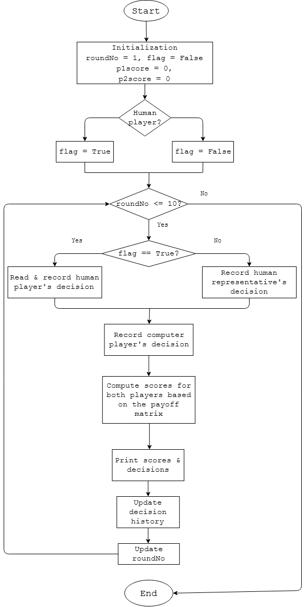
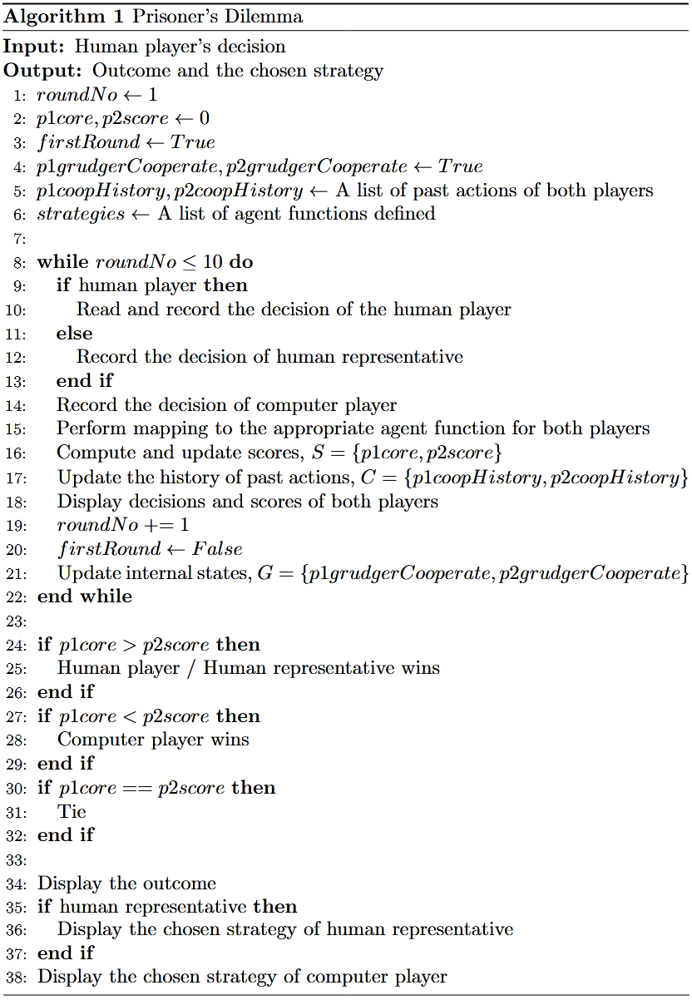

# Prisoner's Dilemma
Sometimes cooperation among people can be difficult even though it's claimed to be the optimal solution. The payoff matrix of this mini game is included.    

 
 

# Project Description
### One mode available
The code can be found [here](https://github.com/Sins-Repo/PrisonersDilemma/blob/main/main.py)
* Human player vs Computer player

 

### Two mode available
The code can be found [here](https://github.com/Sins-Repo/PrisonersDilemma/blob/main/complete/main.py)
* Human player vs Computer player
* Human representative (automated) vs Computer player

 

### Flowchart

 

### Algortihm

 
 

# Strategies 
* allCollude
* allDefect
* randomDecision
* grudger
* tit for tat
* suspicious tit for tat
* reversed tit for tat

 
 

# How to run
1. Clone the repo
2. Make sure IDLE(Python) is installed in the system
3. Open the terminal
4. `cd <project directory>`
5. `python main.py`
